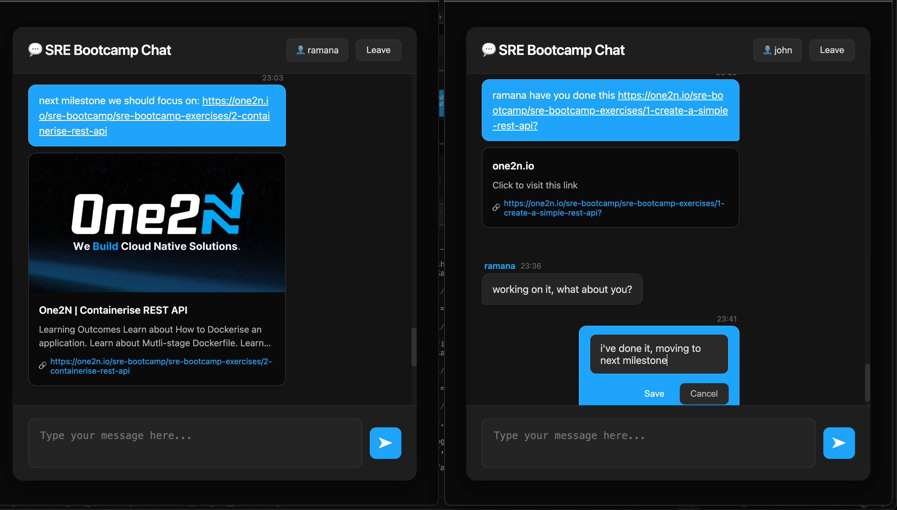
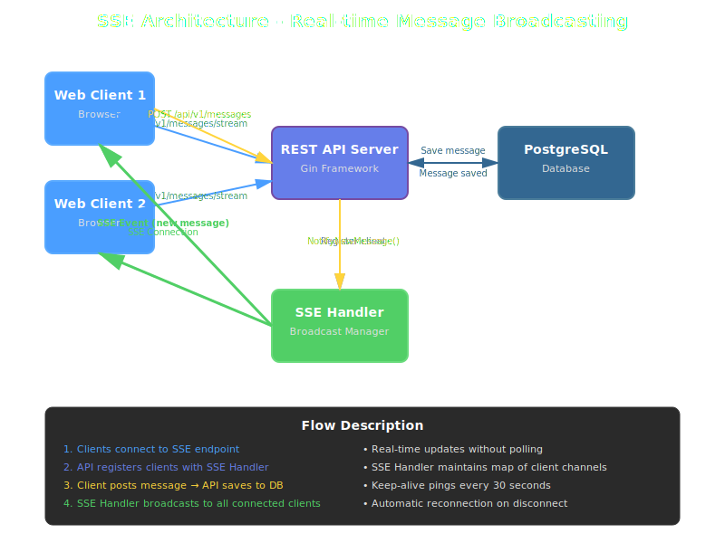

# SRE Chat API - SRE Bootcamp Exercise

A REST API for a real-time chat application built with Go and Gin framework. Features PostgreSQL persistence, Server-Sent Events (SSE) for real-time updates, and a beautiful web interface.

## Web Client

A modern web interface is included - no need for curl or Postman!



### Quick Start

1. **Start the API:**

   ```bash
   make run-api-docker
   ```

2. **Open in Browser:**

   ```text
   http://localhost:8080
   ```

3. **Join Chat:**
   - Enter your name and click "Join Chat"
   - Start chatting with real-time updates!

### Web Client Features

- ✅ Real-time message updates via SSE
- ✅ Edit and delete your own messages
- ✅ Automatic link previews for URLs
- ✅ Clickable email addresses and phone numbers
- ✅ Modern dark theme UI

### SSE Architecture

The application uses Server-Sent Events (SSE) for real-time message broadcasting:



**How it works:**

1. **Client Connection**: Web clients connect to `/api/v1/messages/stream` endpoint
2. **Registration**: API registers each client with the SSE Handler, maintaining a map of client channels
3. **Message Creation**: When a client posts a message, it's saved to PostgreSQL
4. **Broadcasting**: SSE Handler broadcasts the new message to all connected clients in real-time
5. **Keep-Alive**: Server sends ping events every 30 seconds to maintain connections

## API Features

- ✅ REST API with proper HTTP verbs (GET, POST, PUT, DELETE)
- ✅ API versioning (`/api/v1/`)
- ✅ PostgreSQL database with migrations
- ✅ Environment variable configuration
- ✅ Structured logging with zap
- ✅ Health check endpoint
- ✅ Unit tests for all endpoints
- ✅ Postman collection included
- ✅ Dockerized with multi-stage Dockerfile
- ✅ Optimized Docker image size (~65MB)
- ✅ CI/CD pipeline with GitHub Actions (self-hosted runner)

## Prerequisites

### Required Tools

The following tools must be installed on your local machine:

- **Docker** (version 20.10 or higher) - [Install Docker](https://docs.docker.com/get-docker/)
- **Docker Compose** (version 2.0 or higher) - Usually included with Docker Desktop
- **Make** - Usually pre-installed on Linux/macOS. For Windows, use [Chocolatey](https://chocolatey.org/) or [WSL](https://docs.microsoft.com/en-us/windows/wsl/)

### Optional Tools (for local development without Docker)

- Go 1.21 or higher
- PostgreSQL 12 or higher

## One-Click Local Development Setup

This setup uses Docker Compose to run both the API and PostgreSQL database with minimal configuration.

### Quick Start (Recommended)

```bash
# 1. Clone the repository
git clone git@github.com:RamanaReddy0M/sre-chat-api.git
cd sre-chat-api

# 2. Start everything (DB + API)
# This will automatically build the image if needed
make run-api
```

That's it! The API will be available at `http://localhost:8080`.

**Note:** The `run-api` target automatically builds the Docker image if it doesn't exist, so no separate build step is needed.

### Make Targets and Execution Order

The following Make targets are available for local development:

#### 1. **`make start-db`** - Start Database Container
   - Starts the PostgreSQL container
   - Waits for PostgreSQL to be ready
   - Skips if already running

#### 2. **`make migrate-db`** - Check Database Migrations
   - Ensures DB is running (calls `start-db`)
   - Checks if migrations are already applied
   - Note: Migrations run automatically when API starts (via `MIGRATION_ENABLED=true`)

#### 3. **`make build-api-image`** - Build REST API Docker Image
   - Builds the Docker image for the API
   - Uses multi-stage Dockerfile for optimal size

#### 4. **`make run-api`** - Run REST API Container (One-Click Setup)
   - **Automatically:**
     1. Starts the database container (if not running)
     2. Checks and runs migrations (if needed)
     3. Starts the API container
   - **Includes checks:**
     - Verifies DB is running before starting API
     - Checks if migrations are already applied
   - API available at: `http://localhost:8080`

#### Additional Useful Targets

- **`make stop-api`** - Stop all containers (API + DB)
- **`make logs-api`** - View API logs (follow mode)
- **`make logs-all`** - View all logs (API + DB)
- **`make restart-api`** - Restart API container only
- **`make check-db`** - Check if DB container is running
- **`make check-migrations`** - Check if migrations are applied

### Step-by-Step Manual Setup

If you prefer to run steps individually:

```bash
# 1. Start the database
make start-db

# 2. Run migrations (optional - runs automatically on API start)
make migrate-db

# 3. Build the API image (optional - run-api builds it automatically)
make build-api-image

# 4. Start the API
docker compose up -d api

# Or use the one-command approach (recommended):
make run-api
```

### Verify Setup

```bash
# Check if containers are running
docker compose ps

# Check API health
curl http://localhost:8080/api/v1/healthcheck

# View API logs
make logs-api
```

### Troubleshooting

**Database connection issues:**
- Ensure PostgreSQL container is running: `make check-db`
- Check logs: `docker compose logs postgres`

**Migrations not applied:**
- Check migration status: `make check-migrations`
- Manually run migrations: `make migrate-db`

**API not starting:**
- Check logs: `make logs-api`
- Verify DB is ready: `make check-db`
- Restart everything: `make stop-api && make run-api`

## Local Development (Without Docker)

If you prefer to run locally without Docker:

### 1. Clone and Install

```bash
git clone git@github.com:RamanaReddy0M/sre-chat-api.git
cd sre-chat-api
make deps
```

### 2. Database Setup

#### Option A: Docker Compose (PostgreSQL only)

```bash
make docker-up
```

#### Option B: Local PostgreSQL

```bash
createdb -U postgres chat_db
```

### 3. Configure Environment

```bash
cp env.example .env
# Edit .env with your database credentials
```

Or set environment variables:

```bash
export DB_HOST=localhost
export DB_PORT=5432
export DB_USER=postgres
export DB_PASSWORD=postgres
export DB_NAME=chat_db
export DB_SSLMODE=disable
export MIGRATION_ENABLED=true
```

### 4. Run

```bash
make build
make run
```

The server starts on `http://localhost:8080`. Migrations run automatically on startup.

## Docker

The application can be run using Docker with a multi-stage Dockerfile for optimal image size.

### Build Docker Image

```bash
# Build with version tag (semver)
VERSION=1.0.0 make docker-build

# Or manually
docker build -t sre-chat-api:1.0.0 .
```

### Run Docker Container

```bash
# Run with environment variables
VERSION=1.0.0 make docker-run

# Or manually with custom environment variables
docker run --rm -it \
  -p 8080:8080 \
  -e DB_HOST=host.docker.internal \
  -e DB_PORT=5432 \
  -e DB_USER=postgres \
  -e DB_PASSWORD=postgres \
  -e DB_NAME=chat_db \
  -e MIGRATION_ENABLED=true \
  sre-chat-api:1.0.0
```

### Docker with Docker Compose

```bash
# Start PostgreSQL
make docker-up

# Run API container (connects to PostgreSQL)
VERSION=1.0.0 make docker-run-detached

# View logs
make docker-logs-api

# Stop container
make docker-stop
```

**Note:** When running in Docker, use `host.docker.internal` (Mac/Windows) or your host IP (Linux) for `DB_HOST` to connect to PostgreSQL running on the host machine.

### Docker Image Details

- **Multi-stage build**: Separate build and runtime stages for optimal image size
- **Image size**: ~65MB (Alpine-based, statically compiled binary)
- **Security**: Runs as non-root user (`appuser`)
- **Health check**: Built-in health check endpoint monitoring
- **Semver tagging**: Uses semantic versioning (e.g., `1.0.0`, `1.0`, `1`) instead of `latest`

### Available Make Targets

```bash
# Build Docker image
VERSION=1.0.0 make docker-build

# Run container interactively
VERSION=1.0.0 make docker-run

# Run container in background
VERSION=1.0.0 make docker-run-detached

# View container logs
make docker-logs-api

# Stop container
make docker-stop

# Push to registry (set REGISTRY variable)
REGISTRY=ghcr.io/username VERSION=1.0.0 make docker-push
```

## API Endpoints

All endpoints are versioned under `/api/v1/`:

- **GET** `/api/v1/healthcheck` - Health check
- **POST** `/api/v1/messages` - Create message
- **GET** `/api/v1/messages` - List messages
- **GET** `/api/v1/messages/:id` - Get message
- **PUT** `/api/v1/messages/:id` - Update message
- **DELETE** `/api/v1/messages/:id` - Delete message

### Example

```bash
# Create a message
curl -X POST http://localhost:8080/api/v1/messages \
  -H "Content-Type: application/json" \
  -d '{"user": "Alice", "content": "Hello!"}'

# Get all messages
curl http://localhost:8080/api/v1/messages
```

## Testing

```bash
make test              # Run unit tests
make test-coverage     # Run with coverage report
```

Import `postman_collection.json` into Postman for API testing.

## Project Structure

```text
sre-chat-api/
├── cmd/api/main.go           # Application entry point
├── internal/
│   ├── config/               # Configuration management
│   ├── database/              # Database connection & migrations
│   ├── handlers/              # API handlers & tests
│   ├── middleware/            # Logging middleware
│   ├── models/                # Data models
│   └── rest.go                # Router setup
├── migrations/                # SQL migration files
├── web/                       # Web client interface
├── go.mod                     # Dependencies
├── Makefile                   # Build commands
└── postman_collection.json    # Postman collection
```

## Makefile Commands

```bash
make build          # Build the API
make run            # Run the API
make run-api-docker # Start PostgreSQL and run API
make test           # Run tests
make deps           # Install dependencies
make clean          # Clean build artifacts
```

## Troubleshooting

### Database Connection Failed

- Check PostgreSQL is running: `make docker-ps` or `pg_isready`
- Verify credentials in environment variables

### Port Already in Use

- Change `SERVER_PORT` environment variable

### Tests Failing

- Create test database: `createdb -U postgres chat_test_db`

## License

This project is part of the SRE Bootcamp exercises.
